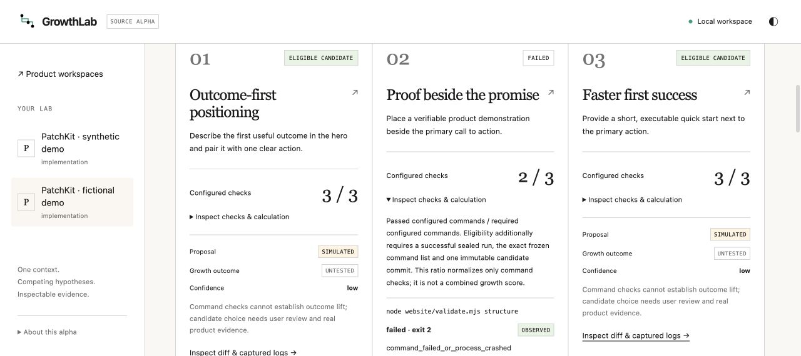

# GrowthLab

### SEO growth ideas you can actually review.

GrowthLab helps you answer a simple question:

> **Which change could help more people find and understand our product?**

GrowthLab is an open-source SEO growth tool for landing pages, content ideas, and the small changes that help a product get found and understood.

Bring in your product, describe an SEO or growth idea, and compare three clear versions side by side. GrowthLab shows the pages, the changes, and the checks behind each option so you can choose what to test next.

It is made for founders, indie hackers, marketers, designers, and developers who want a better way to work on SEO, landing pages, onboarding, and launch messaging.

**Open source · local-first · built for small teams · no Docker**

<!-- project-links:start -->
[Website](https://othmaneblial.github.io/GrowthLab/) · [Docs](https://othmaneblial.github.io/GrowthLab/docs.html) · [Distribution](docs/distribution.md) · [Alpha release](https://github.com/OthmaneBlial/GrowthLab/releases/tag/v0.1.0-alpha.20) · [Roadmap](docs/ROADMAP.md) · [Contribute](CONTRIBUTING.md)
<!-- project-links:end -->



[](docs/demo.md)
[Watch the 30-second demo recording](docs/assets/growthlab-demo-30s.mp4) — a continuous walkthrough captured in an isolated Chrome profile.

## What can I use it for?

- Find a clearer angle for a landing page.
- Turn a search question into a useful page idea.
- Compare titles, sections, calls to action, and onboarding paths.
- Check that a proposed page still works before you publish it.
- Keep a simple record of what you tried and why.

GrowthLab helps you make a better decision. It does not pretend to know your future rankings or sales.

## Why GrowthLab?

Generic AI marketing tools hand back suggestions. GrowthLab keeps the question,
the page versions, the checks and the decision together so you can inspect what
changed before you test it.

| | Generic marketing assistant | GrowthLab |
| --- | --- | --- |
| Starting point | A prompt | Your product page and a clear outcome |
| Ideas | Copy or a list of tactics | Three competing, reviewable versions |
| Confidence | An opinion in a chat | Evidence, checks, limits and provenance |
| Next step | Publish or paste manually | Review, export or apply one explicit choice |

GrowthLab is for SEO and product growth work that needs a real trail: what was
tried, what changed, what passed, and what still needs evidence.

## The simple loop

1. **Bring your product.** Start with the project you already have.
2. **Describe the opportunity.** Example: “Make our page clearer for people searching for invoice software.”
3. **Try three versions.** Each option is kept separate so the original stays safe.
4. **Review and choose.** See the page, the changes, and the checks. Keep the option you want to test.

A failed check stays visible. Nothing is published or changed in your live product automatically.

## See a real example

The bundled demo uses a fictional product called PatchKit. It creates three landing-page ideas:

- two pass the checks and stay available for review;
- one removes the main heading and is marked ineligible;
- the original product remains untouched.

Run it locally. You do not need an agent key:

~~~sh
git clone https://github.com/OthmaneBlial/GrowthLab.git
cd GrowthLab
pnpm -C ui install --frozen-lockfile
pnpm -C ui build
cargo install --path . --bin growthlab --locked
growthlab demo
~~~

The dashboard opens on your machine. The demo is deliberately honest:

**SIMULATED ideas · OBSERVED checks · UNTESTED SEO outcomes**

The alpha verifies the work you asked it to verify. It does not claim a ranking increase, more traffic, or more conversions.

[Demo walkthrough](docs/demo.md) · [Use your own product](docs/configuration.md) · [Run a battle](docs/battles.md) · [Apply, export and report](docs/delivery.md)

For a quick page review, audit one local HTML file without preparing a battle:

```sh
growthlab seo-audit --html ./website/index.html --format markdown
```

The result is an **ESTIMATED** structural SEO review of the supplied file. It
does not fetch the web or claim rankings, traffic, or conversions. See the
[local SEO audit guide](docs/seo-audit.md).

You can review a public product starting point or create a private brief before
you have a checkout:

```sh
growthlab repo-audit --url https://github.com/owner/product --format markdown
growthlab workspace brief --name Acme --audience 'Open-source maintainers' \
  --goal 'Increase qualified signups' --metric qualified_signup
```

The repository review reads one public GitHub metadata response and does not
clone or execute source. The brief creates a local analysis workspace with no
remote, provider request or publication. Both flows keep growth claims
**UNTESTED** until user evidence is supplied.

When you have your own exported observations, summarize them locally:

```sh
growthlab measure --csv ./telemetry.csv --format markdown
```

This reports descriptive means, sample sizes, date range, arithmetic baseline
comparisons and exploratory 95% intervals from the supplied CSV. It is labelled
**MEASURED** because the values come from your file; it does not prove attribution,
causality, statistical significance or growth lift. See the [local measurement guide](docs/measurement.md).

## Current progress

<!-- project-status:start -->
<!-- Generated by scripts/sync-project-status.mjs from docs/status.json. -->
[](docs/PROGRESS.md) [](docs/PROGRESS.md)

**Source alpha · about 95% overall (subjective estimate) · updated 2026-09-17**

Current milestone: **Editable experiment tree with frozen lineage, localized GrowthLab onboarding and inspection details, explicit workspace settings lifecycle, measurement and battle/detail UI, read-only settings contract overview, provider-neutral measurement boundary, deterministic local CLI packaging with complete notices, exact-tag macOS and Linux cross-target archives plus Windows GNU packaging, estimated accessibility structure hints in comparisons and standalone page audits, continuous browser walkthrough, observed timing hints, bundled Chromium and Firefox visual-regression baseline smokes, local Chromium accessibility-tree and keyboard smoke, public repository review, manual-brief onboarding, executable playbooks, public checkout import, distribution-aware measurement and the translated macOS x86_64 source suite validated**.

**Working today**

- Local product import with reviewed growthlab.yaml permissions
- Three competing changes from one frozen starting point in isolated workspaces
- Actual validation commands, inspectable failures, cancellation and sealed evidence
- Dashboard comparison, source previews, diffs, logs and explicit selected apply/export
- Private-by-default offline HTML/Markdown reports and interrupted-run recovery
- Key-free bundled replay demo with one deliberate validation failure
- Published project website and searchable docs with current progress and actual captures
- Published v0.1.0-alpha.2 as a source prerelease with the explainable SEO rubric
- Published v0.1.0-alpha.17 as a source prerelease with the continuous walkthrough
- Published v0.1.0-alpha.18 as a source prerelease with the accessibility structure rubric
- Published v0.1.0-alpha.19 with a validated macOS arm64 CLI archive and checksum
- Published v0.1.0-alpha.20 with opt-in visual report captures, a validated macOS arm64 CLI archive and structure-verified macOS x86_64, Linux musl, Linux arm64 and Windows GNU CLI archives
- Inspected and explicitly resumed pending selected-delivery receipts without rollback
- Reworked the bundled demo to show intent, evidence and an explicit review choice
- Local and SSH launchers self-register their controller PID before payload work
- Automatic desktop and phone PNG capture from sealed preview documents with archive verification
- Explainable SEO page-hygiene rubric with dimension scores and limits
- Standalone local SEO audit with actionable recommendations, JSON or Markdown output and safe file bounds
- Standalone local and read-only public page audits also expose the estimated accessibility structure rubric
- 30-second screen recording captured in an isolated Chrome profile, showing the public site and real demo evidence
- Local CSV measurement summaries with baseline comparisons, sample sizes, date range and MEASURED provenance
- Local browser measurement dashboard over user-supplied CSV with local descriptive comparisons
- Exploratory 95% mean and baseline-difference intervals with documented assumptions
- Ten role-based growth playbooks with questions, outputs and guardrails
- Explicit local-folder onboarding with protected-path checks and an opt-in local Git snapshot
- Read-only public HTTPS SEO audit with robots policy checks and bounded page retrieval
- Public GitHub metadata review and private local manual-brief onboarding
- Saved deterministic playbook runs with ordered answers, outputs and guardrails
- Distribution-aware local measurement comparisons that keep channel baselines separate
- Explicit public GitHub checkout import into a local, configured workspace
- Workspace experiment map showing the shared goal and three untested growth branches
- Prepared battles reuse persisted hypothesis IDs so the map remains linked to each variant
- Inspectable page-quality hints for mobile, controls, form labels, loading sources and claim guardrails
- Estimated accessibility structure rubric for language, landmarks, headings, image alternatives, controls and form labels
- Observed local Chromium render checks for viewport coverage, overflow, visible copy and optional timings
- Transparent observed static-render rubric in comparisons and shareable reports
- Role-grouped experiment tree keeps stable hypothesis IDs linked to each battle
- Editable experiment tree preserves hypothesis identity, evidence and frozen battle contracts
- Comparison rows and private reports preserve hypothesis IDs for end-to-end lineage
- Observed local browser timing rubric for first paint, DOM ready, load and timing metadata with explicit limits
- Localized GrowthLab onboarding shell follows six existing locale catalogs and applies RTL direction for Arabic and Persian
- Provider-neutral measurement source registry exposes local CSV and explicit planned external boundaries without provider requests
- Localized GrowthLab measurement panel follows all six locale catalogs and preserves RTL rendering for Arabic and Persian
- Local GrowthLab settings panel persists language and theme preferences and shows provider-neutral integration state
- Read-only settings contract overview exposes product, permissions, validation, metrics and source snapshot per local workspace
- Workspace contract labels and permission modes follow all six locale catalogs
- Read-only settings contract includes the product description alongside its goal and audience
- Deterministic local CLI packaging with complete checked-in license notices and offline archive verification
- Localized GrowthLab battle/detail inspection, decision and report labels follow all six locale catalogs
- Local x86_64 Linux musl archive built and structure-verified with cargo-zigbuild; current-main rebuild also passed the offline verifier; runtime remains unverified
- Local x86_64 Windows GNU ZIP packaging is deterministic and structure-verified; current-main rebuild and the exact alpha.20 tag archive are verified, with runtime still unverified
- Typed read-only measurement adapter boundary with the local CSV implementation
- Guarded local workspace settings edits write the validated contract atomically before hypotheses are created and never create commits or remote changes
- Localized static-preview, evidence and rubric detail copy across all six dashboard locales, with visible settings lock policy after hypotheses or active battles
- Localized workspace and battle action/status copy across all six dashboard locale catalogs
- Localized dashboard onboarding, audit and auxiliary action/status copy across all six dashboard locale catalogs
- Localized role labels, editor metadata and execution option copy across all six dashboard locale catalogs
- Structured localized playbook titles, questions, outputs and guardrails across all six dashboard locale catalogs
- Localized rubric labels and dimension names across all six dashboard locale catalogs
- Localized rubric calculations, recommendations and limitations across all six dashboard locale catalogs
- Corrected dashboard heading hierarchy and verified live accessible names, IDs, image alternatives and overflow
- Explicit opt-in self-contained HTML and Markdown reports embed verified desktop and phone captures
- Bundled demo visual-regression smoke matches six checked-in local Chromium PNG baselines with archive metadata verification
- Bundled demo Firefox visual-regression smoke matches six additional PNG baselines with viewport and layout invariant verification
- Bundled demo accessibility-tree and keyboard smoke verifies named controls, headings, labels, focus stops and overflow with no provider invocation
- Public alpha.20 release assets have a read-only verifier for GitHub digests, checksum sidecars and archive safety
- Translated macOS x86_64 release suite now passes 964 tests with two inherited ignored tests under Rosetta after allowing the system Rosetta runtime read-only in the confinement profile
- Deterministic native-harness fixture runs three local Claude proposal adapters with no provider credentials; sealed runs remain UNTESTED

| Validation | Current evidence |
| --- | --- |
| Rust tests | **passed** — 966 tests per binary; 964 passed, zero failures and two inherited ignored tests (serial run on the current source) |
| UI tests | **passed** — 174 tests; zero failures or skips |
| Local quality checks | **passed** — Formatting, Clippy, UI types, styles and builds; full serial Rust suite passed |
| Actual demo and browser flow | **passed** — Real CLI/HTTP execution, desktop/phone captures, observed local Chromium render checks and static-render rubric, verified PNG endpoint checks, SEO and accessibility rubric records, page-quality hints and standalone local audit on owned fixtures |
| Accessibility structure rubric | **passed** — Deterministic archived-HTML checks cover language, landmarks, heading hierarchy, image alternatives, named controls and form labels; provenance stays ESTIMATED and does not claim WCAG or assistive-technology conformance |
| Observed browser timing rubric | **passed** — Local Chromium smoke records desktop/phone DOM, load and first-paint timing hints in comparison rows and reports; no Lighthouse, Core Web Vitals, accessibility, visual-regression or field-performance claim |
| GrowthLab localized onboarding | **passed** — Chrome exercised the shared language picker for Spanish and Arabic; the GrowthLab home shell refreshed its copy, Arabic set dir=rtl, desktop scroll width matched the viewport and the tab recorded no warning or error logs |
| Localized measurement panel | **passed** — Chrome switched the measurement panel to Spanish and Arabic; translated headings, source states and controls rendered, Arabic set dir=rtl, viewport width stayed fitted and no browser warnings or errors were recorded |
| GrowthLab settings panel | **passed** — Chrome opened the anchored settings surface and a selected workspace contract, switched the theme to dark and restored the system preference; the read-only contract and permission modes stayed localized within the RTL viewport and browser logs remained empty |
| Local CSV measurement | **passed** — Bounded UTF-8 CSV import smoke passed locally; means, sample sizes, optional date range, baseline differences, exploratory 95% intervals and MEASURED limits are emitted without network access |
| Browser measurement dashboard | **passed** — Local Chrome smoke uploaded a synthetic CSV; the dashboard rendered MEASURED means, sample sizes, baseline differences, date range, 95% intervals and limits with no console warnings or errors |
| Exploratory interval analysis | **passed** — Rust and TypeScript calculations matched on repeated synthetic samples; mean and difference intervals are omitted below n=2 and documented as descriptive normal approximations |
| Growth playbook catalog | **passed** — Read-only API and Chrome smoke expose all ten initial roles with focused questions, outputs and guardrails; no provider or analytics request is made |
| Release build and runtime smokes | **passed** — Fresh locked macOS arm64 build; real CLI import, delivery and HTTP demo; embedded UI verified |
| Selected-delivery recovery | **passed** — 20 battle tests on both binaries; exact candidate finalization and local conflict preservation |
| Cloud CI | **disabled** — Cloud workflows are disabled; validation runs locally |
| Local-folder onboarding | **passed** — CLI and HTTP tests cover refusal without the explicit flag, protected-path refusal before commit, and a local-only initial snapshot with no remote |
| Public URL SEO audit | **passed** — CLI, API and dashboard paths enforce HTTPS-only read-only retrieval, same-origin robots checks, no redirects or credentials and bounded UTF-8 HTML |
| Executable playbooks | **passed** — CLI, API and workspace dashboard execute and persist deterministic role contracts with bounded answers; runs remain UNTESTED and make no provider or product-file request |
| Distribution-aware measurement | **passed** — Local Rust and browser CSV summaries group by metric, distribution or channel and variant; comparisons stay within each distribution and remain MEASURED from user-supplied rows |
| Measurement source boundary | **passed** — Local API and browser panel enumerate one available no-network CSV source plus six planned opt-in boundaries; planned entries remain UNTESTED and no provider credentials or events are accessed |
| Public repository checkout import | **passed** — CLI, API and Home UI clone only after an explicit new destination is supplied; existing contracts are preserved, missing contracts are committed locally, and no push or provider request occurs |
| Workspace experiment map | **passed** — Chrome smoke created the deterministic starter map and rendered the shared goal with positioning, conversion and onboarding branches; cards remain UNTESTED until a battle and local evidence exist |
| Experiment map lineage | **passed** — Rust battle preparation, comparison rows and report tests confirm persisted hypothesis IDs remain linked from the map through frozen battle variants and exported JSON, Markdown and HTML |
| Role-grouped experiment tree | **passed** — Workspace dashboard groups persisted hypotheses by role in accessible branches; stable hypothesis IDs remain linked into prepared battle variants |
| CLI archive packaging | **passed** — Local macOS arm64 archive build includes LICENSE, NOTICE.md, demo and six checked-in dependency notices; an offline verifier passed checksum, traversal/link checks, structure and real version/build-channel execution |
| Localized battle/detail UI | **passed** — Chrome exercised Spanish and Arabic on a real recorded battle; inspection tabs, decision labels and report actions translated, Arabic set dir=rtl, viewport width stayed fitted and no browser warnings or errors were recorded |
| Linux musl archive packaging | **passed** — Local x86_64-unknown-linux-musl release archive built from the exact alpha.20 tag with cargo-zigbuild and Zig; current-main rebuild produced SHA-256 9b34c05918f22f662bb58153e97d04f4bc7d70f530276deb4cc1af01052f3f63, and the offline verifier passed SHA-256, traversal/link safety, required notices and archive structure. The tagged asset is attached to alpha.20 and runtime was honestly skipped on macOS arm64 |
| macOS Intel archive packaging | **passed** — Local x86_64-apple-darwin release archive built from the exact alpha.20 tag with Cargo; offline verifier passed SHA-256, traversal/link safety, required notices and archive structure, the asset is attached to alpha.20, and its version command passed under Rosetta on macOS arm64; native x86_64 hardware remains untested |
| Linux arm64 archive packaging | **passed** — Local aarch64-unknown-linux-musl release archive built from the exact alpha.20 tag with cargo-zigbuild and Zig; offline verifier passed SHA-256, traversal/link safety, required notices and archive structure, the asset is attached to alpha.20, and runtime was honestly skipped on macOS arm64 |
| Measurement adapter contract | **passed** — LocalCsvAdapter implements the shared read-only request/report contract; focused Rust measurement and API tests passed and no provider request is made |
| Editable workspace settings | **passed** — Focused API and configuration tests prove validated local writes, stale-file refusal, atomic replacement and refusal after hypotheses or active battles; UI exposes localized save/cancel controls without automatic commits or remotes |
| Localized technical details and settings lifecycle | **passed** — Six locale catalogs cover static-preview evidence, render metadata and rubric detail labels; Chrome verified the edit control is enabled before hypotheses and disabled with an explicit Arabic lock explanation after the starter map is created |
| Localized workspace and battle actions | **passed** — GrowthDashboard action and status labels for the experiment tree, battle execution, candidate inspection and selected delivery now use localized message keys; six catalogs define the shared keys, Chrome verified Spanish and Arabic controls, and the 174-test UI suite passes |
| Localized auxiliary dashboard copy | **passed** — The six locale catalogs now cover dashboard busy states, home onboarding, public page and repository audit controls, playbook controls and execution status feedback; i18n, style, type, build and 174 UI tests pass, and Chrome verified the Spanish home flow with no browser warnings or errors |
| Localized role and metadata copy | **passed** — Role names, hypothesis editor labels, execution choices, check metadata and delivery notices now use the six locale catalogs; i18n, style, type, build and 174 UI tests pass, and Chrome verified Spanish role labels and footer copy |
| Localized playbook content | **passed** — The ten role playbooks now map titles, focus, summaries, questions, outputs, guardrails and saved-run follow-up text through locale catalogs; i18n, style, type, build and 174 UI tests pass, and Chrome verified Spanish playbook content |
| Localized rubric labels | **passed** — Five SEO, quality, accessibility, static-render and browser-timing rubric labels, dimensions and static guidance now resolve through all six locale catalogs; i18n, style, type, production build and 174 UI tests pass, and Chrome verified Spanish battle and public-URL audit guidance. |
| Localized rubric observations | **passed** — Known evaluator-generated rubric evidence sentences now map counts, HTML states, viewport checks and timing tokens through all six locale catalogs; unrecognized evaluator text and user-authored run content keep their recorded language and provenance. |
| Live dashboard accessibility structure smoke | **passed** — Chrome AX and DOM inspection on a recorded battle found 23 named interactive controls, one h1 with no skipped heading level, no duplicate IDs, no images missing alt text and no horizontal overflow; this remains a local structure smoke, not WCAG or assistive-technology certification. |
| Visual report disclosure | **passed** — CLI --include-visuals and API includeVisuals=true explicitly embed verified archived desktop/phone PNGs; default reports omit captures, Rust report tests cover opt-in encoding and the 4 MiB bound, and the screenshot-required bundled demo asserts both default omission and six opt-in captures without provider requests. Embedded captures remain render artifacts, not visual-regression, accessibility, performance or growth results. |
| Bundled visual regression smoke | **passed** — The real bundled demo's three sealed variants match six checked-in SHA-256 PNG baselines at 1280x900 desktop and 390x844 phone; archive dimensions, digests and the no-provider boundary are verified locally. This is a pinned local renderer smoke, not cross-browser parity or assistive-technology conformance. |
| Bundled Firefox visual regression smoke | **passed** — The real bundled demo's three sealed preview documents match six additional checked-in SHA-256 PNG baselines in Firefox 139.0.4 at 1280x900 desktop and 390x844 phone; viewport dimensions, overflow, named controls, heading-level continuity and the no-provider boundary are verified locally. Safari, other browser versions and assistive-technology conformance remain unverified. |
| Bundled accessibility-tree and keyboard smoke | **passed** — A real recorded bundled battle rendered in local Chromium; 19 DOM and AX interactive controls were named, one h1 had no skipped level, IDs/images/forms and overflow passed, and 30 Tab events reached visible focus stops without invoking a provider. The optional --output JSON handoff records all role/name pairs and providerInvoked=false. This remains a local structure and keyboard smoke, not screen-reader, cross-browser or WCAG evidence. |
| Windows GNU package smoke | **passed** — The current source built x86_64-pc-windows-gnu with cargo-zigbuild and Zig; current-main packaging produced SHA-256 745d90bb9d51d70c535abd0e600421a95c39d81ac3bf0bc39834b3eff3d2eba7 and the offline archive verifier passed checksum, traversal/link and notice checks. The exact alpha.20 tag ZIP is attached to the public release; Windows runtime, MSVC packaging and signing remain unverified. |
| Public release asset verification | **passed** — The read-only scripts/test-release-assets.py check downloads all five alpha.20 archive/checksum pairs, matches GitHub asset digests and sidecars, and passes archive safety/notices verification; macOS arm64 runtime passes locally, macOS x86_64 passes under Rosetta, and Linux and Windows runtimes are skipped on the macOS host. |
| Native harness boundary fixture | **passed** — scripts/test-growth-native-fixture.py used a disposable fake Claude CLI with no provider credentials; the current binary created three isolated worktrees, accepted valid implementation JSON, ran observed checks and sealed three UNTESTED runs while the product HEAD, files and remotes stayed unchanged. This verifies the local harness boundary, not a real provider response. |
| Translated macOS x86_64 source suite | **passed** — The current source x86_64-apple-darwin release suite ran under Rosetta on macOS arm64: 964 passed, zero failed and two inherited ignored tests. The confinement profile now permits only the Apple Rosetta runtime directory read-only; this does not prove native Intel hardware or the separately attached alpha.20 archive beyond its version smoke. |

**Still ahead**

- Provider adapters
- Full visual regression and assistive-technology accessibility evaluation
- Real native-agent battle verification and provider-specific launcher registration
- Unrecognized or future rubric evidence and user-generated run content remain source-language until an explicit mapping is added
- Cross-platform runtime proof, MSVC support and portable installers
<!-- project-status:end -->

The percentage is a human estimate against the full [product specification](docs/SPEC.md), not a traffic or ranking metric. Local checks show what has been verified; they do not prove SEO lift, provider authorization, or production readiness. See the detailed [progress log](docs/PROGRESS.md).

## Built on OpenResearch

GrowthLab starts from [alphaXiv/OpenResearch](https://github.com/alphaXiv/OpenResearch), and we are grateful for that foundation.

OpenResearch provides the local-first runtime, permissions, dashboard, process supervision, and safe workspace primitives underneath this project. GrowthLab adds the SEO growth layer: ideas, competing page versions, evidence, decisions, and reports.

OpenResearch is the base that made GrowthLab possible. We keep its upstream history, preserve its MIT license and notice, and build this independent product on top. alphaXiv does not endorse GrowthLab.

## For people who want the details

- Rust and SQLite keep the core local and easy to inspect.
- Each option is made in an isolated workspace.
- Checks run on the option that was actually recorded.
- Static previews use archived page files, with scripts and outside resources blocked.
- New ready runs can archive verified desktop and phone PNGs plus observed local Chromium checks for viewport coverage, overflow and visible copy when a browser is available.
- Reports are private by default.
- Cloud CI is disabled; checks run locally.

[Architecture audit](docs/openresearch-foundation.md) · [Domain API](docs/growth-api.md) · [Preview boundaries](docs/static-previews.md) · [Security policy](SECURITY.md)

## Develop and contribute

~~~sh
cargo test --locked
pnpm -C ui test
node scripts/dev-slot.mjs start --db empty
node scripts/dev-slot.mjs status
node scripts/dev-slot.mjs stop
~~~

Please inspect contributions before sharing them.

[Contribution guide](CONTRIBUTING.md) · [Roadmap](docs/ROADMAP.md) · [Release notes](CHANGELOG.md) · [Code of conduct](CODE_OF_CONDUCT.md)
