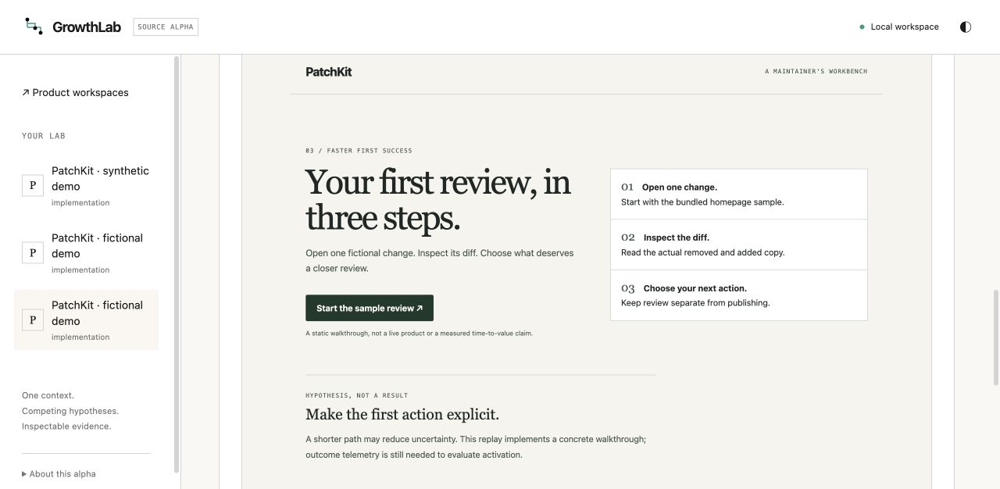

# GrowthLab

### Your growth ideas. Real diffs.

Run competing product changes from the same Git baseline. Inspect the code,
checks and evidence behind each one. Choose what ships.

**Local-first · Rust + SQLite · Isolated Git worktrees · No Docker**

<!-- project-links:start -->
[Documentation](docs/dashboard.md) · [Roadmap](docs/ROADMAP.md) · [Contribute](CONTRIBUTING.md)
<!-- project-links:end -->


An AI proposal is a starting point. GrowthLab makes it reviewable: actual changed
files, a fixed evaluation contract, captured command output, immutable evidence
and an explicit delivery decision. It is being built as an open-source growth
team for developers, indie hackers and small product teams.

The working alpha includes a key-free replay demo. Its proposals are declared
fixtures; its edits, commits, checks and archives execute for real in Rust.
Native-agent battles are still awaiting verification.

## What happens in a Growth Battle?

1. **Freeze the baseline.** Import a local Git product and review its goal,
   permitted paths and validation commands in `growthlab.yaml`.
2. **Run three approaches.** Each competitor gets the same contract and its own
   isolated Git worktree. Checks execute on the recorded candidate snapshot.
3. **Inspect the tradeoffs.** Compare results, source previews, diffs, evidence
   and logs. A failed check stays visible and makes that candidate ineligible.
4. **Make the decision.** Select a candidate, export its patch or explicitly
   apply it to a clean matching product checkout. No automatic commit or push.
5. **Keep the evidence.** Export an offline HTML/Markdown report with private
   context withheld by default.

| A useful proposal needs… | GrowthLab supplies today |
| --- | --- |
| An implementation you can review | Real files and diffs from committed candidate objects |
| A fair comparison | One frozen source snapshot and validation contract for all competitors |
| Evidence behind a recommendation | Actual exit codes, logs, provenance and verified archive digests |
| Room for your judgment | Explicit candidate selection and guarded apply/export |
| A reproducible starting point | An original bundled product and deterministic replay plan |

## Current progress

<!-- project-status:start -->
<!-- Generated by scripts/sync-project-status.mjs from docs/status.json. -->
[](docs/PROGRESS.md) [](docs/PROGRESS.md)

**Source alpha · about 40% overall (subjective estimate) · updated 2026-09-16**

Current milestone: **Three real variants with sealed evidence and archived static previews**.

**Working today**

- Local Git workspace import and reviewed growthlab.yaml permissions
- Three competing changes from one frozen baseline in isolated Git worktrees
- Actual validation commands, inspectable failures, cancellation and sealed evidence
- Dashboard comparison, source previews, diffs, logs and explicit selected apply/export
- Private-by-default offline HTML/Markdown reports and interrupted-run recovery
- Key-free bundled replay demo with one deliberate validation failure

| Validation | Current evidence |
| --- | --- |
| Rust tests | **passed** — 911 per binary; zero failures; two inherited ignored tests |
| UI tests | **passed** — 167 tests; zero failures or skips |
| Local quality checks | **passed** — Formatting, Clippy, UI types, styles and builds |
| Actual demo and browser flow | **passed** — Real CLI/HTTP execution and desktop/phone checks on owned fictional fixtures |
| GitHub CI | **disabled** — All six workflows manually disabled; validation runs locally |

**Still ahead**

- Automatic per-run PNG capture and a short real demo recording
- Native-agent battle verification and remaining launch/delivery recovery
- Complete experiment tree, settings and localized interface
- Broader inputs, growth playbooks and real measurement
- Cross-platform runtime proof and release packaging
<!-- project-status:end -->

Progress is an estimate of the full [product specification](docs/SPEC.md).
Local test results prove the behavior covered by those checks; they do not prove
growth lift, provider authorization, cross-platform runtime or production readiness.
The detailed work log is in [PROGRESS.md](docs/PROGRESS.md).

## Try the real demo

Source prerequisites: **Git, stable Rust/Cargo, Node.js 22+ and pnpm 10**.
Validation requires `/usr/bin/sandbox-exec` on macOS, or `/usr/bin/bwrap` with
permitted unprivileged namespaces on Linux. macOS is locally verified; Linux
runtime verification is pending. Windows validation isolation is not implemented.

```sh
git clone https://github.com/OthmaneBlial/GrowthLab.git
cd GrowthLab
pnpm -C ui install --frozen-lockfile
pnpm -C ui build
cargo install --path . --bin growthlab --locked
growthlab demo
```

The command opens the local dashboard and creates a fictional PatchKit baseline
plus three real competitors. One deliberately removes the primary heading and
fails validation; two remain eligible for review. Nothing is selected or applied
automatically. The demo requires no agent API key and no Docker.

**SIMULATED proposals · OBSERVED checks · UNTESTED growth outcomes**

The alpha calls eligible variants **Recommended candidates**. It does not claim
that a page increased conversions or won a live experiment.

[Demo walkthrough](docs/demo.md) · [Use your own product](docs/configuration.md) ·
[Run a battle](docs/battles.md) · [Apply, export and report](docs/delivery.md)



Static previews come from permitted committed HTML/CSS/assets, displayed in an
opaque, inert frame. They are live views of archived source, with scripts and
external resources blocked. Automatic saved screenshots and dynamic-app rendering
remain pending. [Preview boundaries](docs/static-previews.md).

## Built around evidence

```text
Product repository + growthlab.yaml
                 │
      Frozen source + battle contract
                 │
    ┌────────────┼────────────┐
 Variant A    Variant B    Variant C
 worktree     worktree     worktree
    └────────────┼────────────┘
                 │
   Snapshot checks + sealed run archives
                 │
   Compare → select → explicit apply/export
```

The Rust/Axum core owns orchestration, permissions, delivery and the domain API.
SQLite persists workspaces, variants, attempts and decisions. The React dashboard
reads verified checkpoints and archives. Generic agent harnesses, Git primitives
and process supervision come from the OpenResearch foundation.

[Architecture audit](docs/openresearch-foundation.md) · [Domain API](docs/growth-api.md)

## Local by default. Explicit at the boundaries.

- Product changes stay in isolated worktrees until you authorize selected apply.
- Validation commands require OS confinement with no unrestricted fallback.
- Default reports omit private goals, names, paths, prompts and raw logs.
- Source builds disable upstream telemetry and refuse the upstream updater.
- Native proposals require explicit authorization to send permitted context to
  the chosen provider. Installation/authentication is not assumed.
- Agents do not automatically deploy, purchase ads, message people, change live
  billing or analytics, or push to your product repository.

This is a source alpha. Coordinate other writers to your checkout and inspect
changes before committing them. See [confinement limits](docs/confinement.md),
[recovery behavior](docs/recovery.md) and [security policy](SECURITY.md).

## Develop and contribute

```sh
cargo test --locked
pnpm -C ui test
node scripts/dev-slot.mjs start --db empty
node scripts/dev-slot.mjs status
# When finished:
node scripts/dev-slot.mjs stop
```

The development helper isolates its database, ports and owned processes. The
canonical CLI is `growthlab`; `orx` remains a compatibility entry point.
GitHub CI is disabled at the user's request; checks run locally.

[Contribution guide](CONTRIBUTING.md) · [Roadmap](docs/ROADMAP.md) ·
[Release notes](CHANGELOG.md) · [Code of conduct](CODE_OF_CONDUCT.md)

## OpenResearch foundation

Built from [alphaXiv/OpenResearch](https://github.com/alphaXiv/OpenResearch), with
upstream history preserved. GrowthLab extends its local-first experimentation
architecture into a new product domain. MIT licensed; retain [LICENSE](LICENSE)
and [NOTICE.md](NOTICE.md). alphaXiv does not endorse GrowthLab.
