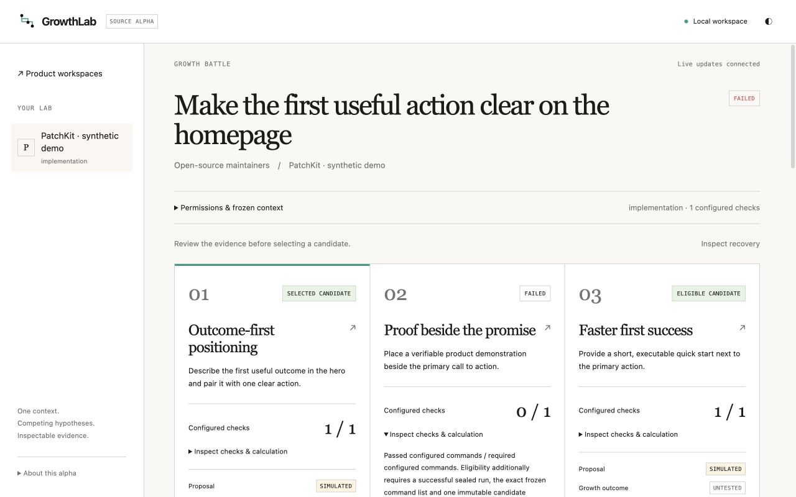

# GrowthLab local dashboard

The source-alpha dashboard is a client of the Rust battle engine. The home,
workspace and battle screens use `/api/growth`; they do not simulate backend jobs.
Inherited research routes remain available for compatibility.

## Start and import

From a source checkout with the prerequisites in the README:

```sh
node scripts/dev-slot.mjs start --db empty
node scripts/dev-slot.mjs status
```

Open the UI URL printed by the helper. This creates isolated development data;
it does not copy your regular database. For an installed canonical binary,
`growthlab up` serves the embedded dashboard. Stop the development slot with
`node scripts/dev-slot.mjs stop`.

Use a local Git product with a reviewed, committed `growthlab.yaml`, following
[configuration.md](configuration.md). Import its repository root from Home.
Import records the committed context and baseline; it does not publish the product.
Existing workspaces are accessible from Home on desktop and phone layouts.

Home's **Run bundled demo** starts a real replay battle on a newly created
fictional product without a provider key. One proposal deliberately fails a
heading check. See [demo.md](demo.md) for expected results and limitations;
the button never automatically selects or applies a candidate.

On the workspace screen, inspect permissions and commands, enter a goal, and
prepare a landing-page battle. The three initial hypotheses are deterministic
**UNTESTED** templates. Each competitor receives the same frozen source and
contract, and an isolated worktree. Worktree execution requires implementation
permission. The playbook catalog is available in every mode; analysis-only and
Draft artifact execution remain a separate product gate.

## Execute and inspect

Choose an explicit proposal source:

- **Declared replay:** paste schema-v1 JSON or load a local file, using the format
  in [battles.md](battles.md). It requires three implementations. Proposals are
  **SIMULATED**; Rust still performs actual allowed edits, commits, checks and seals.
- **Native harness:** select an adapter that can disable proposal tools and
  authorize sending the allowed context to its provider. Installation and
  authentication are separate prerequisites. Native execution is unverified in
  this alpha; missing CLIs fail honestly. No provider request is made in replay mode.

Submission returns HTTP 202 to acknowledge an owned controller, not a completed
experiment. The dashboard reads persisted status and receives SSE invalidations.
Captured checkpoints distinguish active work from sealed terminal runs. A crash
does not create a successful outcome; use explicit recovery to inspect registered
jobs and captured evidence without rerunning commands or providers.

Expand each check fraction to see commands, actual exit codes, snapshot digests,
evaluator calculation, confinement policy digests and limitations. Checks are
**OBSERVED**. Growth outcomes remain **UNTESTED** without real outcome evidence.
Passing commands establish eligibility for user review, not conversion lift.

When a recorded option contains HTML, the card also exposes **SEO page hygiene
(estimated)**. Expand it to see the eight structural dimensions and their direct
observations. The 100-point rubric checks page metadata and basic content shape;
it does not estimate rankings, traffic or conversion and does not replace a
real crawl, accessibility audit or performance measurement.
The expanded card also lists concrete next steps for every partial or missing
dimension, so the review can turn directly into a page edit.

For a quick review before creating a battle, run
`growthlab seo-audit --html ./website/index.html`. Add `--format markdown` for a
shareable local note. The command reads one regular UTF-8 file and makes no
network request; see [seo-audit.md](seo-audit.md).

When a product already has a local telemetry export, use the **Bring a local
outcome export** panel on Home or summarize it from the terminal with
`growthlab measure --csv ./telemetry.csv --format markdown`. Both paths report
descriptive means, sample sizes, date range and arithmetic baseline comparisons,
plus exploratory 95% intervals when sample sizes allow. They are labelled
**MEASURED** and do not claim attribution or statistical significance. The
browser panel reads the selected CSV in memory and sends no rows to a provider.
See [measurement.md](measurement.md) for the interval assumptions.

The Home screen also exposes ten reusable growth playbooks: strategist, researcher,
positioning, conversion, ethical SEO, onboarding, pricing, launch, evaluator and
skeptic. Each card shows the questions, outputs and guardrails for that role. They
are templates only; reading them makes no provider request and creates no outcome
claim. See [playbooks.md](playbooks.md).

Select a variant and switch between hypothesis/evidence, diff/files/logs and
the optional static preview.
The inspector reads verified archives or checkpoints, not mutable worktree files.
Artifacts are displayed as escaped text. Configured static pages have a separate
restricted preview of archived source; scripts and external resources are blocked.
Ready runs also expose a verified desktop PNG captured from that sealed source
when local Chromium is available. It is a render artifact, not a visual quality
score. See
[static-previews.md](static-previews.md). Private prompts and policy files are
excluded from this viewer. Keyboard arrows, Home and End move between the three
inspection tabs.

## Explicit delivery and sharing

Record an eligible variant as the selected candidate. Export its patch to a new
path outside the product and worktrees, or review the apply preview. Applying
requires a separate confirmation checkbox and button, and the backend rechecks
selection, sealed evidence, permissions and a clean original baseline.
Apply changes only the original working tree; it does not commit, push or deploy.
See [delivery.md](delivery.md) for refusals and receipt semantics.

HTML and Markdown downloads omit private product names, goals, paths, raw logs
and prompts by default. They retain provenance, check results, selection and
reproducibility digests. Explicit context disclosure and removable attribution
are available through the report API and CLI; review disclosed reports before sharing.

## Boundaries and remaining work

The API inherits the dashboard's loopback/origin boundary and optional remote-host
authentication. Loopback operation is not multiuser authorization. A shared storage
lease pins API operations and running controllers against another dashboard's
data-directory move. Project admission prevents local deletion during owned work.
This is not complete cross-process coordination for every inherited or CLI path.

The source-alpha screens are English. Localization of GrowthLab screens, experiment
tree, richer evaluators, cautious statistical analysis, provider adapters,
broader inputs, real telemetry integrations and release packaging remain required
work. The inherited eager UI bundle still produces a size warning. Linux confinement
requires native runtime proof; Windows validation is unsupported. Resource quotas
are not provided. GitHub Actions stays disabled; all checks run locally.

See [growth-api.md](growth-api.md) for the API contract and
[PROGRESS.md](PROGRESS.md) for observed validation results.

These captures show actual Rust execution of an owned fictional replay. They
are dashboard screenshots, not candidate HTML renders or measured growth results.



[Phone comparison](screenshots/growth-battle-phone.png) ·
[Phone failed check](screenshots/growth-battle-phone-failure.png) ·
[Phone artifact inspector](screenshots/growth-battle-phone-artifacts.png)
