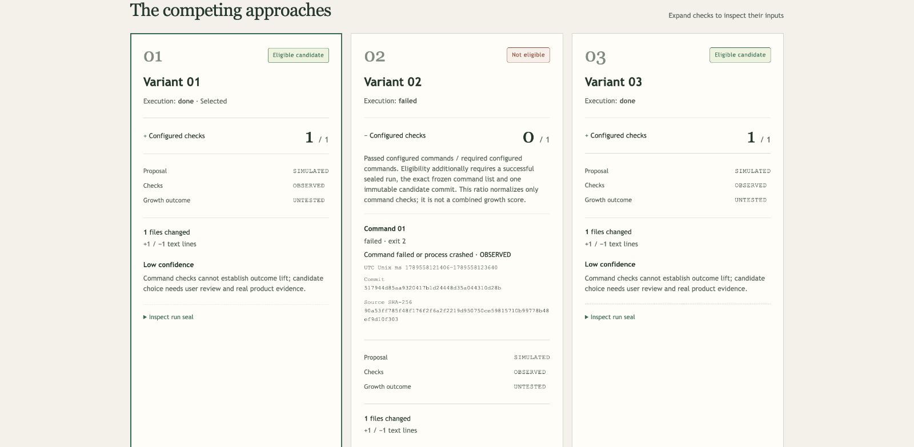

# Select, apply, export and report

These operations use a verified, eligible **sealed** candidate. Passing configured
commands supports a recommendation, not measured conversion success. Replay
proposals remain SIMULATED, actual checks OBSERVED and growth outcomes UNTESTED.

## Explicit selection

Inspect a completed battle with the [battle CLI](battles.md), then choose one
variant ID from its comparison:

~~~sh
growthlab compare <battle-id>
growthlab select <variant-id>
growthlab battle-status <battle-id>
~~~

Selection records a local candidate decision. It does not change product files.
The selection ledger records intentions and terminal receipts separately from
immutable run outcomes. Failed candidates cannot be selected, applied or exported.
A battle with one failed competitor can still have eligible alternatives.

## Apply to a clean baseline

~~~sh
growthlab apply <variant-id> --check
growthlab apply <variant-id>
~~~

The first command previews changed paths and the patch digest without applying
or recording a delivery. The second explicitly authorizes APPLY_SELECTED: it
copies that candidate's patch into the product working tree. Review the resulting
diff and commit it using your normal product workflow.

Apply requires the original product HEAD at the frozen source commit, unchanged
implementation configuration, an ordinary clean index/checkout and allowed
regular files. Local staged/unstaged/untracked changes, sparse/assume-unchanged
entries, symlinks, changed policy or baseline bytes cause refusal. Exact touched
file bytes are checked independently of Git status. The all-hunk Git check is
repeated immediately before applying. Coordinate other writers to that checkout.

No automatic commit, merge, push or deployment occurs. HEAD, index and remotes
remain unchanged. Only the selected variant is delivered; there is no automatic
choice among tied eligible candidates.

Patch generation uses fixed source/candidate object IDs, disables external
diff/text conversion and verifies committed changed blobs against sealed artifacts.
Mutable variant branches/worktrees do not supply delivery contents. Missing Git
objects cause a clear refusal rather than falling back to unsealed work.

Intent persistence must succeed before a product write. Completed/failed receipts
cannot be overwritten. If filesystem delivery succeeds but receipt finalization
fails, the CLI explicitly reports that delivery occurred and a pending receipt
needs inspection. Automated interrupted-delivery recovery remains a release gate.

## Portable local patch

~~~sh
growthlab export <variant-id> --output /path/outside/product/selected.patch
~~~

Export writes a Git binary-capable patch and records its SHA-256 in a local
receipt. The product may have advanced or have local edits; export does not
touch that checkout. Applying the patch elsewhere still requires your own
baseline/review checks.

An explicit output file must be outside product/variant checkouts, its parent
directory must exist and the destination must be new. Completed same-directory
temporary files are installed using a create-only hard link: existing files and
dangling symlinks are refused. Files are owner-only on Unix. A filesystem without
hard-link support fails clearly; it does not use an overwriting fallback.

The patch contains real selected product code and relative changed file names.
It is a private local delivery artifact, not a public report or publication.

## Self-contained reports

~~~sh
growthlab report <battle-id> --output /path/outside/product/battle.html
growthlab report <battle-id> --format markdown --output /path/outside/product/battle.md
~~~

HTML and Markdown report the three competitors, actual command results/exit
codes, eligibility, proposal/check/outcome provenance, archived diff counts,
low confidence, the latest completed explicit selection and reproducibility
digests. HTML uses expandable method/check/seal details and works offline without
JavaScript, external fonts, images or network requests. A restrictive content
policy and escaped text prevent exported product text from becoming active HTML.

Default reports withhold the private product goal, names, titles, summaries,
command text, file paths, model identifiers, prompts and raw logs. Variants and
commands receive neutral numbered labels. Report output never changes selection.
To disclose a public goal without other private context:

~~~sh
growthlab report <battle-id> --output battle.html --public-goal 'Compare three activation approaches'
~~~

The following flag is explicit approval to disclose the configured goal,
variant titles, implementation summaries and command text. Those fields can
contain identifying names or paths; review the exported file before sharing.
Common credentials remain redacted. Dedicated product metadata, full prompts
and raw logs are never copied.

~~~sh
growthlab report <battle-id> --output reviewed-context.html --include-context
growthlab report <battle-id> --output unbranded.html --without-attribution
~~~

The optional footer attribution can be removed. Report destinations use the same
atomic create-only file writer as patches. Tampered run evidence refuses report
generation. Reports are summaries, not a substitute for the private source,
configuration, prompts and logs needed to reproduce the product run.

When a sealed run contains verified static-preview captures, pass
`--include-visuals` to embed the archived desktop and phone PNGs in the HTML or
Markdown report. The default remains capture-free. Embedded images carry their
dimensions and SHA-256 digest and are render artifacts, not accessibility,
performance, visual-regression or growth results. The screenshot-required
bundled demo smoke (`GROWTHLAB_REQUIRE_SCREENSHOT=1 python3
scripts/test-growth-demo.py`) verifies both viewport captures and their read-only
endpoints without contacting a provider.

The report itself has been inspected in Chrome at desktop and phone sizes:

[Phone report preview](screenshots/cli-report-phone.jpg). These captures show
report UI generated by `scripts/test-growth-battle.py`, with declared replay edits
and actual commands. They are not screenshots of the competing product pages.
Reproduce the public fixture report after building:

~~~sh
mkdir -p /tmp/growthlab-public-report
python3 scripts/test-growth-battle.py target/debug/growthlab /tmp/growthlab-public-report
~~~

The optional directory receives only derived public HTML/Markdown summaries.
The smoke fixture cleans up its synthetic repositories and private run store;
each run's timestamps, commit IDs and seals differ.
